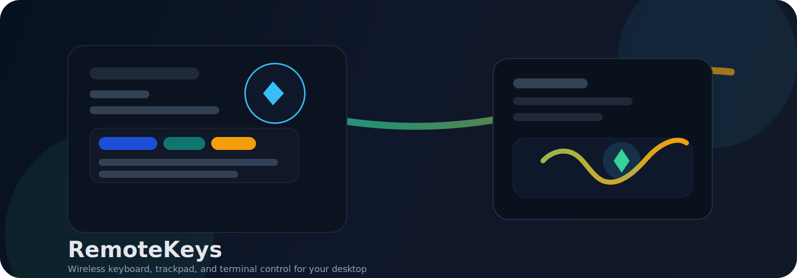
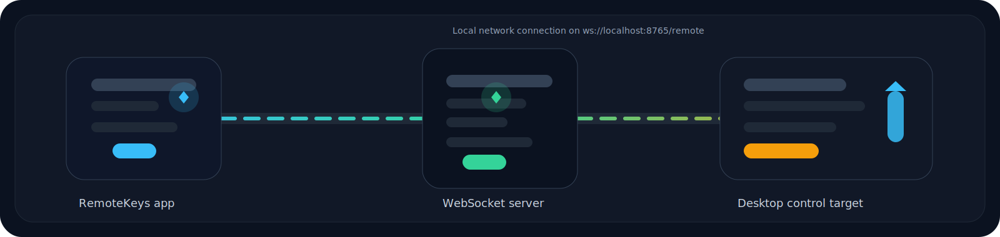

# RemoteKeys

[](https://developer.apple.com/)
[](https://developer.apple.com/xcode/swiftui/)
[](https://developer.mozilla.org/en-US/docs/Web/API/WebSockets_API)



RemoteKeys turns your phone into a clean wireless control surface for your Mac or PC. Use the SwiftUI app to type, move the cursor, scroll, drag, and send terminal commands over a local WebSocket connection.



## What You Get

- Keyboard control with modifier keys, function key access, and caps-lock aware input.
- Trackpad-style cursor movement, scrolling, zooming, dragging, and tap actions.
- Live connection status with latency, device info, and terminal output streaming.
- Theme and accent customization for a polished app appearance.
- macOS and Windows companion server scripts for desktop-side control.

## Project Layout

- `App/` contains the SwiftUI client.
- `websocket_server_macos.py` is the macOS companion server.
- `websocket_server_windows.py` is the Windows companion server.

## Requirements

- iPhone or iPad running the RemoteKeys app.
- A Mac or Windows computer on the same Wi-Fi network.
- Python 3.10+ on the desktop machine.

## Setup

### 1. Start the desktop server

Choose the script that matches the computer you want to control.

#### macOS

```bash
pip3 install websockets psutil pyobjc
python3 websocket_server_macos.py
```

#### Windows

```bash
pip install websockets psutil
python websocket_server_windows.py
```

By default, the server listens on `ws://localhost:8765`.

### 2. Connect the iOS app

1. Open RemoteKeys on your phone.
2. Enter the desktop machine's local IP address.
3. Keep the port set to `8765` unless you changed it in the server.
4. Tap Connect.

## How It Works

RemoteKeys sends JSON commands over WebSocket to the companion server. The client handles input locally, then streams events such as `key`, `move`, `scroll`, `drag`, `click`, `dblclick`, and `terminal` to the desktop machine.

## Tips

- Keep both devices on the same network for the most reliable connection.
- Allow local network access when prompted by iOS.
- If latency feels high, verify the desktop server is running and the host address is correct.

## License

No license file is included yet.